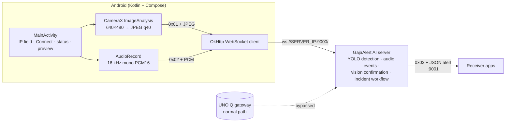

# Fallback: GajaAlert Direct-Stream Sensor App

**An Android field-sensor app for the [GajaAlert](https://github.com/nakultt/GajaAlert) elephant early-warning system. It streams live camera frames and microphone audio from a phone straight to the GajaAlert AI server over WebSocket.**

In the normal deployment, the field phone streams to an Arduino UNO Q edge gateway, which classifies audio and relays video to the AI server. **Fallback** skips the gateway. When the UNO Q is unavailable, the phone connects directly to the AI server's ingest port (`:9000`) using the same binary framing, so detection keeps working.

---

## Features

- Enter the AI server's LAN IP and connect or disconnect with one tap
- Runtime permission flow for **camera** and **microphone**
- **Video:** CameraX at 640×480. Frames are JPEG-encoded (quality 40) and sent continuously.
- **Audio:** `AudioRecord` at 16 kHz, mono, 16-bit PCM, streamed in chunks
- Live camera preview and connection status in a Jetpack Compose UI

## Architecture



### Wire protocol

Every WebSocket message is binary, and its first byte identifies the payload type:

| Prefix | Payload |
|---|---|
| `0x01` | JPEG video frame |
| `0x02` | 16 kHz mono signed 16-bit PCM audio chunk |

These are the same message types the UNO Q gateway forwards, so the server needs no changes to accept a phone directly.

## Build and run

Requires Android Studio and a device on Android 15 (API 35) or newer, on the same network as the AI server.

```bash
./gradlew installDebug
```

1. Start the GajaAlert AI server.
2. Open the app, enter the server IP, and tap **Connect**.
3. Grant camera and microphone permissions. Streaming starts immediately.

## Tech stack

Kotlin · Jetpack Compose · Material 3 · CameraX · AudioRecord · OkHttp WebSocket
